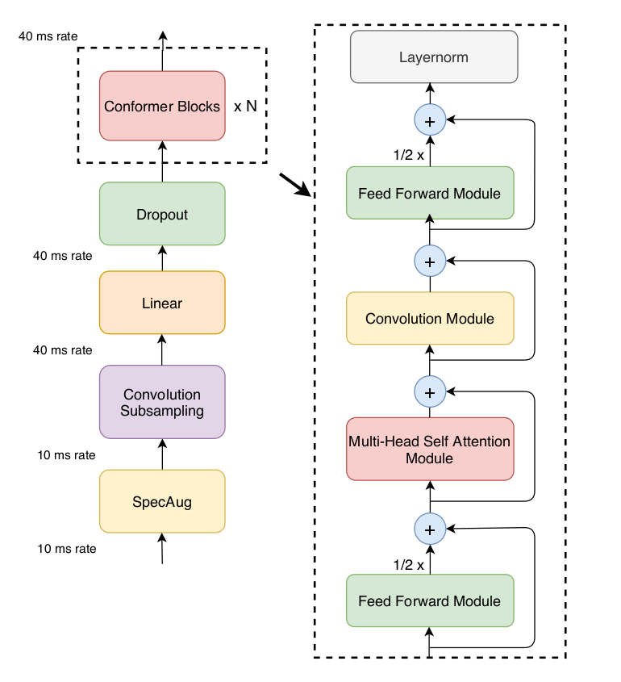
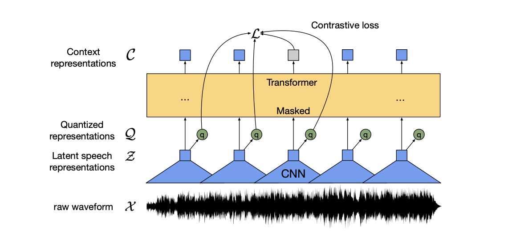

## Table of contents

1. [Instroduction](#introduction)
2. [How to use `Arizona-asr`](#how_to_use)
   - [Installation](#installation)
   - [Data structrue](#data_structure)
   - [Example usage](#usage)
4. [Reference](#reference)

# <a name='introduction'></a> Arizona-asr

Arizona-asr is a library provide Transformer architectures for Automatic speech recognition problem.

We provide two main SoTA architectures:

1. Conformer [[1]](#conformer)



2. Wav2vec 2.0 [[2]](#wav2vec2.0)



# <a name='how_to_use'></a> How to use Arizona-asr

## Installation <a name='installation'></a>

```js
>>> git@github.com:phanxuanphucnd/Arizona-asr.git

>>> cd Arizona-asr

>>> python setup.py bdist_wheel

>>> pip install dist/arizona_asr-0.0.1-py3-none-any.whl 
```

## <a name='data_structure'></a> Data Structure

```
data
    train

    valid

    test

```

## <a name='usage'></a> Example usage

### Training

```py

```

### Evaluation

```py

```

### Inference

```py

```


# <a name='reference'></a> Reference

<a name='conformer'></a> [1] Anmol Gulati, James Qin, Chung-Cheng Chiu, Niki Parmar, Yu Zhang, Jiahui Yu, Wei Han, Shibo Wang, Zhengdong Zhang, Yonghui Wu and Ruoming Pang: “[Conformer: Convolution-augmented Transformer for Speech Recognition](https://arxiv.org/abs/2005.08100)”, in arXiv:2005.08100, 2020.

<a name='wav2vec2.0'></a> [2] Alexei Baevski, Henry Zhou, Abdelrahman Mohamed and Michael Auli: “[wav2vec 2.0: A Framework for Self-Supervised Learning of Speech Representations](https://arxiv.org/pdf/2006.11477.pdf)”, in arXiv:2006.11477, 2020.

# License

      MIT License

      Copyright (c) 2021 Phuc Phan

      Permission is hereby granted, free of charge, to any person obtaining a copy
      of this software and associated documentation files (the "Software"), to deal
      in the Software without restriction, including without limitation the rights
      to use, copy, modify, merge, publish, distribute, sublicense, and/or sell
      copies of the Software, and to permit persons to whom the Software is
      furnished to do so, subject to the following conditions:

      The above copyright notice and this permission notice shall be included in all
      copies or substantial portions of the Software.

      THE SOFTWARE IS PROVIDED "AS IS", WITHOUT WARRANTY OF ANY KIND, EXPRESS OR
      IMPLIED, INCLUDING BUT NOT LIMITED TO THE WARRANTIES OF MERCHANTABILITY,
      FITNESS FOR A PARTICULAR PURPOSE AND NONINFRINGEMENT. IN NO EVENT SHALL THE
      AUTHORS OR COPYRIGHT HOLDERS BE LIABLE FOR ANY CLAIM, DAMAGES OR OTHER
      LIABILITY, WHETHER IN AN ACTION OF CONTRACT, TORT OR OTHERWISE, ARISING FROM,
      OUT OF OR IN CONNECTION WITH THE SOFTWARE OR THE USE OR OTHER DEALINGS IN THE
      SOFTWARE.

  
# Author

- Name: Phan Xuan Phuc
- Email: phanxuanphucnd@gmail.com
